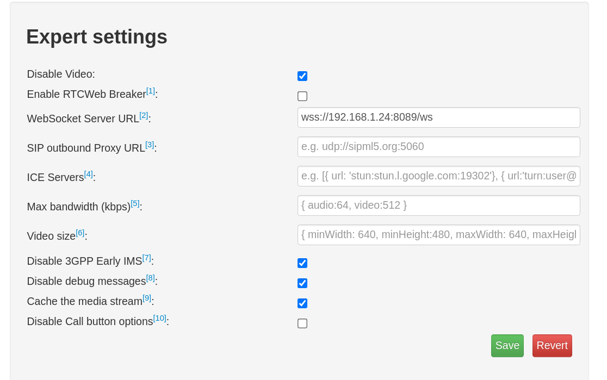

### TRƯỚC KHI BẮT ĐẦU
--------
Update hệ thống

```bash
sudo yum update
```
Disable SELinux and reboot machine

Tắt chức năng SELinux
```bash
sed -i 's/SELINUX=enforcing/SELINUX=disabled/g' /etc/selinux/config
sudo systemctl reboot
```

### Cấu hình tường lửa
--------
Thêm dịch vụ SIP vào phần cấu hình tường lửa

```bash
sudo firewall-cmd --zone=public --permanent --add-service={sip,sips}
```
Thêm hai cổng sử dụng cho WebRTC vào cấu hình tường lửa

```bash
sudo firewall-cmd --zone=public --permanent --add-port=
8089/tcp
sudo firewall-cmd --zone=public --permanent --add-port=
8088/tcp
```

Thêm dịch vụ HTTP và HTTPS vào phần cấu hình tường lửa

```bash
sudo firewall-cmd --zone=public --permanent --add-service={http,https}
```

### Tải PJPROJECT
--------
Tải các dependencies cho việc build

```bash
sudo yum install epel-release gcc-c++ ncurses-devel libxml2-devel wget openssl-devel newt-devel kernel-devel-`uname -r` sqlite-devel libuuid-devel gtk2-devel jansson-devel binutils-devel bzip2 patch libedit libedit-devel
```
Tạo một thư mục Asterisk

```bash
mkdir ~/asterisk
```
Di chuyển vào thư mục trên và thực hiện download PJPROJECT 

```bash
wget https://www.pjsip.org/release/2.8/pjproject-2.8.tar.bz2
```

Giải nén file vừa download về


```bash
tar -jxvf pjproject-2.8.tar.bz2
```

Di chuyển vào thư mục vừa giải nén và chạy file `configure` với các option đi kèm

```bash
./configure CFLAGS="-DNDEBUG -DPJ_HAS_IPV6=1" --prefix=/usr --libdir=/usr/lib64 --enable-shared --disable-video --disable-sound --disable-opencore-amr
```

Build các plugin

```bash
make dep
make
```

Tải các packages đi kèm

```bash
sudo make install
sudo ldconfig
```

### Cài đặt Asterisk
--------

Di chuyển trở về thư mục đã tạo trước đó và thực hiện download Asterisk

```bash
wget http://downloads.asterisk.org/pub/telephony/asterisk/asterisk-16-current.tar.gz
```

Giải nén file vừa tải về

```bash
tar -zxvf asterisk-16-current.tar.gz
```

Di chuyển vào thư mục vừa giải nén


```bash
cd asterisk-16.1.1
```

### Cấu hình và xây dựng Asterisk
--------

Chạy file `configure` để chuẩn bị source code cho việc compile

```bash
./configure --libdir=/usr/lib64 --with-jansson-bundled
```

Sau khi quá trình `confiure` hoàn thành ta có thể chọn thêm các feature muốn build thêm

```bash
make menuselect
```

Lúc này ta phải bảo đảm bảo rằng hai `resource modules` này đã được chọn trong `menuselect`

```bash
res_srtp
res_cryto
```

Sau khi chắc chắn ta có thể thực hiện compile Asteisk

```bash
make
```

Khi compile xong ta thực hiện cài đặt Asterisk

```bash
sudo make install
```

Ta có thể tạo ra các file cấu hình mẫu với command sau

```bash
sudo make samples
```

### Kiểm tra kết nối

Khởi động Asterisk Asterisk

```bash
sudo systemctl start asterisk
```

Để bảo đảm Asterisk sẽ chạy khi khỏi động ta phải `enable` nó lên

```bash
sudo systemctl enable asterisk
```

Truy cập giao diện dòng lệnh của Asterisk

```bash
sudo asterisk -rvvvvvvv
``` 
```

### Cấu hình Asterisk cho WebRTC Clients

Để cấu hình Asterisk cho WebRTC Clients ta phải có chứng thực, hướng dẫn dưới dây sẽ giúp tạo self-sign certificates cho Asterisk, để tạo certificates ta sử dụng command sau

```bash
sudo contrib/scripts/ast_tls_cert -C <IP-Address-of-Asterisk-Server> -O "My Organization" -b 2048 -d /etc/asterisk/keys
```

Thay thế `IP-Address-of-Asterisk-Server` với địa chỉ IP của Asterisk server. Sau khi `Enter` ta sẽ phải nhập password một vài lần cho certificates
Sau khi xong, ta sẽ sử dụng `asterisk.crt` và `asterisk.key` để cấu hình cho HTTP và HTTPS

### Cấu hình Asterisk
#### Cấu hình Asterisk built-in HTTP server

Cấu hình `/etc/asterisk/http.conf` 

```bash
[general]
enabled=yes
bindaddr=0.0.0.0
bindport=8088
tlsenable=yes
tlsbindaddr=0.0.0.0:8089
tlscertfile=/etc/asterisk/keys/asterisk.crt
tlsprivatekey=/etc/asterisk/keys/asterisk.key
```

Khởi động lại và kiểm tra TLS server đã chạy với Asteisk CLI command
```
http show status
```
#### Cấu hình PJSIP
##### PJSIP WSS Transport

Cấu hình `/etc/asterisk/pjsip.conf`

```bash
[transport-wss]
type=transport
protocol=wss
bind=0.0.0.0
```
##### PJSIP Endpoint, AOR và Auth

```bash
[User1]
type=aor
max_contacts=5
remove_existing=yes

[User1]
type=auth
auth_type=userpass
username=User1
password=User1 

[User1]
type=endpoint
aors=User1
auth=User1
dtls_auto_generate_cert=yes
webrtc=yes
; Setting webrtc=yes is a shortcut for setting the following options:
; use_avpf=yes
; media_encryption=dtls
; dtls_verify=fingerprint
; dtls_setup=actpass
; ice_support=yes
; media_use_received_transport=yes
; rtcp_mux=yes
context=default
disallow=all
allow=opus,ulaw
```

### WEBRTC sử dụng SIPML5
#### Cấu hình Asterisk Dialplan

Cấu hình `/etc/asterisk/extensions.conf`

```bash
[default]

exten=>6001,1,Dial(PJSIP/webrtc_client_1,20)
exten=>6002,1,Dial(PJSIP/webrtc_client_2,20)
```

### Cấu hình SIPML5

Truy cập [SIPML5](https://www.doubango.org/sipml5/) để cấu hình SIPML5 Client
Click vào "Enjoy our live demo" và cấu hình như sau 

 
Thay thế địa chỉ IP bằng địa chỉ IP của Asterisk Server

Tiếp theo, click `expert mode` và cấu hình như sau



Cuối cùng, để có thể login được ta phải truy cập vào đường link `https://<IP-Asterisk-Server>:8089/ws` để chấp nhận certificates mà ta đã tạo trước đó. Sau khi `Accept` trang web sẽ giống như sau


Sau khi hoàn thành bước trên ta có thể click `Login`, nếu xuất hiện `connected`
là đã login thành công

Để có thể thực hiện một cuộc gọi đơn giản ta cấu hình `extensions.conf` như sau

```bash
[default]

exten=>6001,1,Dial(PJSIP/webrtc_client_1,20)
exten=>6002,1,Dial(PJSIP/webrtc_client_2,20)
```
### Thực hiện cuộc gọi

Trong ô SIPML5 ta nhập 6002 sau đó nhấn nút `Call`


Click vào "Audio". Khi đó trình duyệt sẽ yêu cầu quyền cho phép truy cập vào micro của máy


Click chọn "Allow."
Sau khi click `Allow` ta sẽ thấy cuộc gọi đang trong quá trình xử lý


Khi bên kia nhận cuộc gọi, cuộc gọi sẽ được hiển thị là `In Call`


Tới đây là ta đã thực hiện được một cuộc gọi bằng WebRTC thông qua Asterisk
