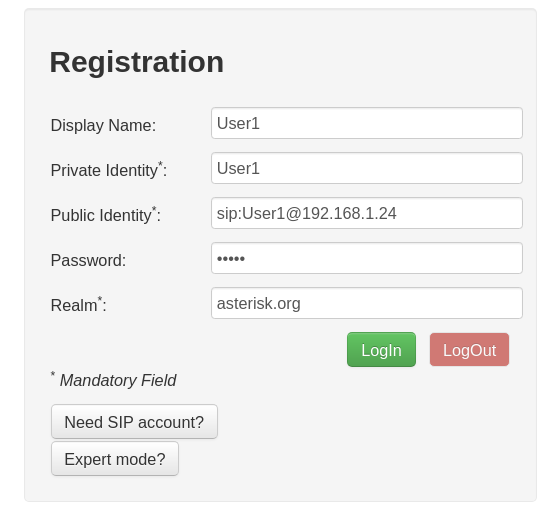
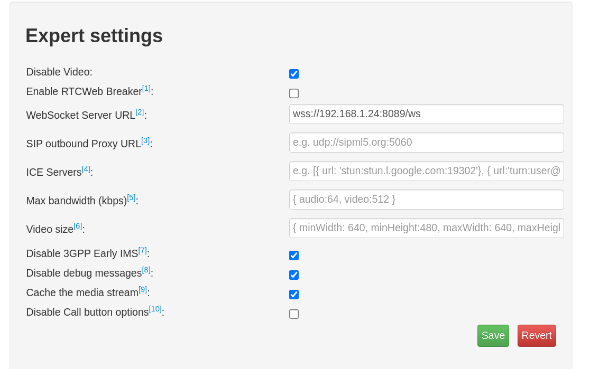
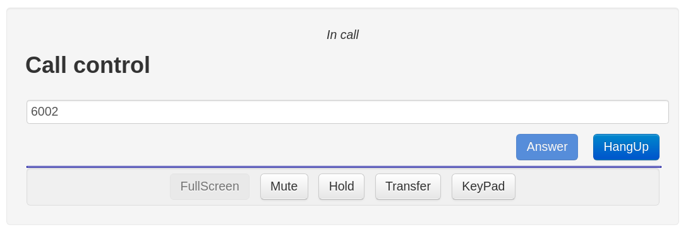

### Before we begin
--------
Update system

```bash
sudo yum update
```
Disable SELinux and reboot machine

```bash
sed -i 's/SELINUX=enforcing/SELINUX=disabled/g' /etc/selinux/config
sudo systemctl reboot
```

### Configure firewall
--------

We need to add the SIP services to firewall configuation

```bash
sudo firewall-cmd --zone=public --permanent --add-service={sip,sips}
```

Add two ports for WebRTC

```bash
sudo firewall-cmd --zone=public --permanent --add-port=
8089/tcp
sudo firewall-cmd --zone=public --permanent --add-port=
8088/tcp
```

Add HTTP and HTTPS services

```bash
sudo firewall-cmd --zone=public --permanent --add-service={http,https}
```

### Install PJPROJECT
--------

Install build dependencies

```bash
sudo yum install epel-release gcc-c++ ncurses-devel libxml2-devel wget openssl-devel newt-devel kernel-devel-`uname -r` sqlite-devel libuuid-devel gtk2-devel jansson-devel binutils-devel bzip2 patch libedit libedit-devel
```

Make a directory for the build

```bash
mkdir ~/asterisk
```

Change to that directory and starting download PJPROJECT

```bash
wget https://www.pjsip.org/release/2.8/pjproject-2.8.tar.bz2
```

Extract it

```bash
tar -jxvf pjproject-2.8.tar.bz2
```

Change to extracted directory and run configure file with flags and options

```bash
./configure CFLAGS="-DNDEBUG -DPJ_HAS_IPV6=1" --prefix=/usr --libdir=/usr/lib64 --enable-shared --disable-video --disable-sound --disable-opencore-amr
```

Ensure that all dependencies are in place and build the plugin

```bash
make dep
make
```

Install the packages:

```bash
sudo make install
sudo ldconfig
```

### Install Asterisk
--------

Change back to directory that we create early and starting download asterisk

```bash
wget http://downloads.asterisk.org/pub/telephony/asterisk/asterisk-16-current.tar.gz
```

Unzip the file

```bash
tar -zxvf asterisk-16-current.tar.gz
```

Change to extracted directory

```bash
cd asterisk-16.1.1
```

### Configure and Build Asterisk
--------

Run `configure` file to prepare source code for compiling

```bash
./configure --libdir=/usr/lib64 --with-jansson-bundled
```
After configuation complete we can select more features we want to build

```bash
make menuselect
```

At this point we need to ensure following resources module is installed

```bash
res_srtp
res_cryto
```

After that we need to compile Asterisk with

```bash
make
```
When done we need to install Asterisk

```bash
sudo make install
```

We can install sample configuration files with

```bash
sudo make samples
```

### Test Connection

Start Asterisk

```bash
sudo systemctl start asterisk
```

To ensure that asterisk service starts even after a reboot, enable the service

```bash
sudo systemctl enable asterisk
```

To access Asterisk CLI

```bash
sudo asterisk -rvvvvvvv
``` 

### Configure Asterisk for WebRTC Clients

To configure Asterisk for WebRTC Clients we need to create a certificates, we need to change to directory that we install Asterisk before and run following command.

```bash
sudo contrib/scripts/ast_tls_cert -C <IP-Address-of-Asterisk-Server> -O "My Organization" -b 2048 -d /etc/asterisk/keys
```
We need to change IP-Address-of-Asterisk-Server match with Asterisk Server
After run the script you will need to type password for several time. Remember this password for later use
We'll use the asterisk.crt and asterisk.key files later to configure the HTTP server.

### Asterisk Configuration
#### Configure Asterisk's built-in HTTP server

Configure `/etc/asterisk/http.conf`

```bash
[general]
enabled=yes
bindaddr=0.0.0.0
bindport=8088
tlsenable=yes
tlsbindaddr=0.0.0.0:8089
tlscertfile=/etc/asterisk/keys/asterisk.crt
tlsprivatekey=/etc/asterisk/keys/asterisk.key
```

Restart Asterisk and make sure TLS server is running by issuing the following CLI command.
```
http show status
```
#### Configure PJSIP
##### PJSIP WSS Transport

Configure `/etc/asterisk/pjsip.conf`

```bash
[transport-wss]
type=transport
protocol=wss
bind=0.0.0.0
```
##### PJSIP Endpoint, AOR and Auth

```bash
[User1]
type=aor
max_contacts=5
remove_existing=yes

[User1]
type=auth
auth_type=userpass
username=User1
password=User1 

[User1]
type=endpoint
aors=User1
auth=User1
dtls_auto_generate_cert=yes
webrtc=yes
; Setting webrtc=yes is a shortcut for setting the following options:
; use_avpf=yes
; media_encryption=dtls
; dtls_verify=fingerprint
; dtls_setup=actpass
; ice_support=yes
; media_use_received_transport=yes
; rtcp_mux=yes
context=default
disallow=all
allow=opus,ulaw
```

### WEBRTC USING SIPML5
#### Configure Asterisk Dialplan

Configure `/etc/asterisk/extensions.conf`

```bash
[default]

exten=>6001,1,Dial(PJSIP/webrtc_client_1,20)
exten=>6002,1,Dial(PJSIP/webrtc_client_2,20)
```

### Configure SIPML5

Visit [SIPML5](https://www.doubango.org/sipml5/) site to configure SIPML5 Client
Click the "Enjoy our live demo" link to be directed to the sipml5 client.
Configure Registration box as following

 

Next, we click on expert mode and configure as following



Last but not least, before click on Login button we need to navigate to `https://<IP-Asterisk-Server>:8089/ws` and accept certificates,
after accept you will see something like this


Finally we can click login and if success you will see `connected` appearance on page
We can configure `extensions.conf` as following to create a simplpe dialplan
```bash
[default]

exten=>6001,1,Dial(PJSIP/webrtc_client_1,20)
exten=>6002,1,Dial(PJSIP/webrtc_client_2,20)
```
### Make a test call

In the SIPML5 control box input 6002. Then press Call button. You'll see a drop-down


Select "Audio" to continue.  Once you do this, Firefox will display a popup asking permission to use your microphone:


Click "Allow."
Next, the Call control box will indicate that the call is proceeding:


Finally, when the call is connected, you will see In Call:



You've just made your first call via WebRTC using Asterisk!
