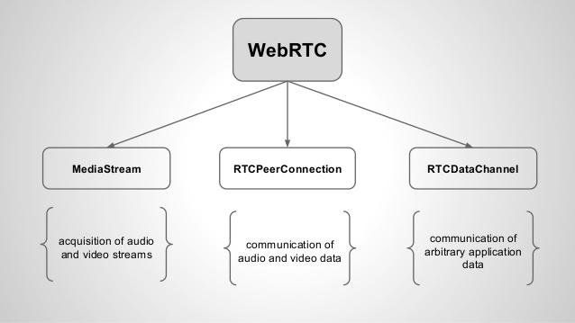
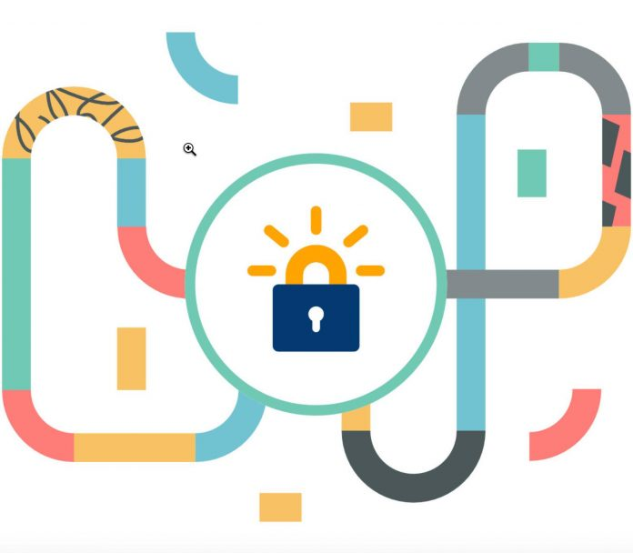
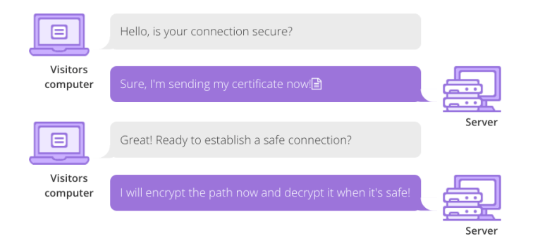

#### Tìm hiểu về giao thức WS, WSS, và WebRTC

##### Webrtc là gì?

**WebRTC** (Web Real-Time Communication) là một tập hợp các hàm lập trình (web API) được phát triển bởi World Wide Web Consortium (W3C). Khả năng hỗ trợ trình duyệt giao tiếp với nhau theo thời gian thực bằng video, âm thanh hay truyền tải dữ liệu “Peer-to-Peer” (P2P) mà không cần browser phải cài thêm plugins hay phần mềm hỗ trợ nào từ bên ngoài. WebRTC có thể giúp chúng ta gọi điện video ngay trong trình duyệt mà không cần đăng kí tài khoản.

**WebRTC** cung cấp 3 API chính:
`getUserMedia`: cho phép trình duyệt web truy cập vào camera và/hoặc microphone để lấy dữ liệu hình ảnh âm thanh cho việc truyền tải.
`RTCPeerConnection`: dùng để cài đặt videocall/voicecall dùng cho việc truyền tải.
`RTCDataChannel`: cho phép trình duyệt chia sẻ dữ liệu peer-to-peer.

Dựa vào đó có thể liệt kê các step cho một ứng dụng `WebRTC` như sau:

1.  Sử dụng `getUserMedia` API để truy cập vào camera và microphone
2.  Lấy thông tin network như địa chỉ IP, ports và trao đổi thông tin đó với các peer khác (những peer mà mình muốn connect tới) để tạo connection (kết nối) dù cho có bị ngăn cản bởi `NATs` hay `firewalls`. (Các bạn thấy phần 1 giúp ích như thế nào cho phần này rồi chứ?
3.  Sau đó thì dùng `RTCPeerConnection` và `RTCDataChannel` để voice call/ video call hoặc chia sẻ dữ liệu sau khi đã có kết nối peer-to-peer

##### Web Socket (ws)
**Websocket** là giao thức hỗ trợ giao tiếp hai chiều giữa client và server để tạo một kết nối trao đổi dữ liệu. Giao thức này không sử dụng HTTP mà thực hiện nó qua TCP. Mặc dù được thiết kế để chuyên sử dụng cho các ứng dụng web, lập trình viên vẫn có thể đưa chúng vào bất kì loại ứng dụng nào.
Ưu điểm:
- Độ trễ thấp và dễ sửa lỗi
- Đáp ứng được các ứng dụng cần thời gian thực (real-time)
- Khắc phục được nhiều nhược điểm của phương pháp Comet streaming
- Dễ xử lý lỗi phát sinh

Nhược điểm:
- Websocket chưa được hỗ trợ trên tất cả trình duyệt vì chỉ xuất hiện trong HTML5 
- WebSocket khó sử dụng với các dịch vụ có phạm vi yêu cầu ví dụ như Session in view filter của HIbernate vì WebSocket không có tính năng này.

##### TLS (Transport Layer Security)

TLS là một công nghệ bảo mật gúp mã hóa liên lạc giữa website và trình duyệt giống như tiền thân của nó là SSL. Nhưng gì SSL đang trở nên lỗi thời và được thay thế hoàn toàn bởi TLS

TLS là chữ viết tắt của Transport Layer Security và được sử dụng cho giao thức HTTPS (Hypertext Transfer Protocol Secure).

Những điều cơ bản của TLS tương tự như với SSL có thể kể đến như là :
- Bảo mật các thông tin nhạy cảm trong quá trình sử dụng Internet
- Giải pháp thay thế cho phương pháp truyền thông tin văn bản dạng plain text

##### Cách thức hoạt động của TLS
Có thể hiểu cách thức hoạt động của TLS cơ bản như sau:
1. Client sẽ gửi yêu cầu đến cho Server, Server sẽ trả lời với bản sao certificate của mình cùng với session ID 
2. Client sẽ xác thực certificate đó với bên cung cấp là có đáng tin hay không, nếu xác thực thành công client sẽ tham gia vào session
3. Qúa trình handshake sẽ bắt đầu và hai bên bắt đầu trao đổi public key và private key cho nhau
4. Khi quá trình handshake diễn ra thành công, hai bên sẽ mã hóa và giải mã dữ liệu trong quá trình trao đổi trên Internet.

